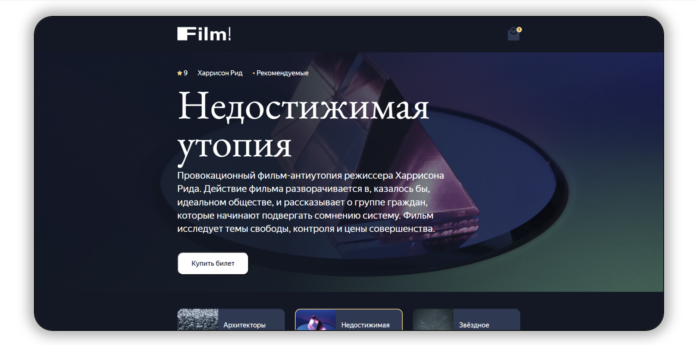

# Film!

[The Docs is in English](./docs/README.en.md)

## Описание
Это мой **особый** проект, где я **с нуля реализовал архитектурный подход**, вдохновляясь **Redux, MobX, Vuex, Effector и EventEmitter из Node.js**.

**В основе — собственная система управления состоянием (AppStateModel + AppStateEmitter) с подпиской на события и централизованным обновлением данных, по принципу Pub/Sub.**

Контроллеры связывают данные и представление в стиле MVC, а экраны — это компоненты, реагирующие на изменения состояния, как в **Vue.js** или **React**.

**Главная особенность** — полная независимость от сторонних библиотек для состояния и маршрутизации. Всё построено на собственном EventEmitter и строгом разделении слоёв приложения.



[Если стало интерестно, то вот ещё один мой проект, который сделан по похожему принципу](https://github.com/DKMFzF/web-larek-MVC.git)  

## Стек
- HTML
- SCSS
- TS
- Webpack

## Структура проекта:
- ```src/``` — исходные файлы проекта
- ```src/components/``` — папка с JS-компонентами
- ```src/components/base/``` — папка с базовым кодом
- ```src/components/model/``` — папка с моделями данных
- ```src/components/controller/``` — папка с моделями контроллеров
- ```src/components/view``` — папка с классами отображения
    - ```/common``` — папка с базовыми классами отображения
    - ```/partial``` — папка с конкретными классами отображения
    - ```/screen``` — папка с классами отображения экрана

## Важные файлы:
- ```src/pages/index.html``` — HTML-файл главной страницы
- ```src/types/all-files.ts``` — файл с типами
- ``src/index.ts`` — это точка входа в приложение
- ``src/scss/styles.scss`` — корневой файл стилей
- ``src/utils/constants.ts`` - файл с константами
- ``src/utils/utils.ts` с утилитами

## Установка и запуск
Для установки и запуска проекта выполните следующие команды

```
npm install
npm run start
```

или

```
yarn
yarn start
```


## Сборка

```
npm run build
```

или

```
yarn build
```

## Автор

[Кирилл Дорошев (DKMFzF)](https://vk.com/dkmfzf )

## Лицензия

Этот проект лицензирован по лицензии MIT
